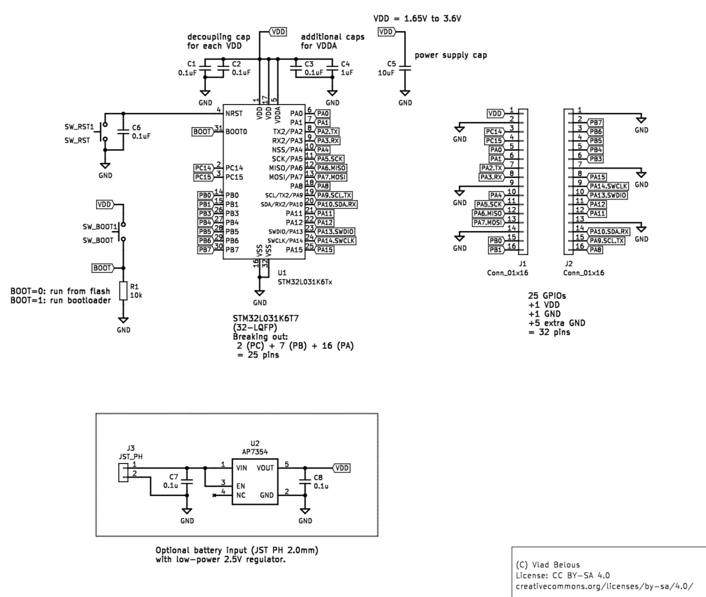
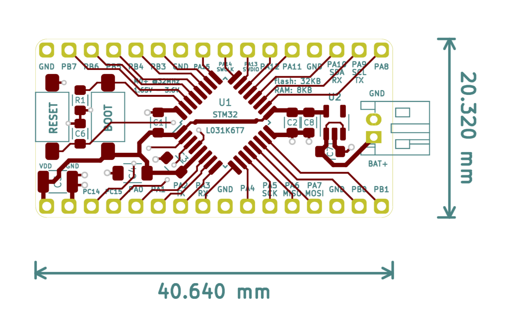

# STM32L031x Simple Breakout

This is a simple breakout board for STM32L031K6T7 (LQFP-32) microcontroller, featuring:
* Cortex M0+ core, up to 32MHz
* 32KiB flash, 8KiB SRAM, 1KiB EEPROM

Board includes decoupling and supply capacitors, and two buttons for reset and entering bootloader.

Most pins are broken out, and extra GND pins/headers added for convenience.

STM32L-series is optimized for low power, so there's also optional:
* battery input connector (JST PH 2.0mm)
* a 2.5V LDO (AP7354 or pin-compatible)

The AP7354 has very low quiescent current (< 0.6uA), which may be useful for MCU sleeping.

Designed with KiCad 5 (www.kicad.org).

## Schematic:

## Layout:

## Toolchain setup
TODO

## Firmware uploading
TODO

## Blink example
TODO
